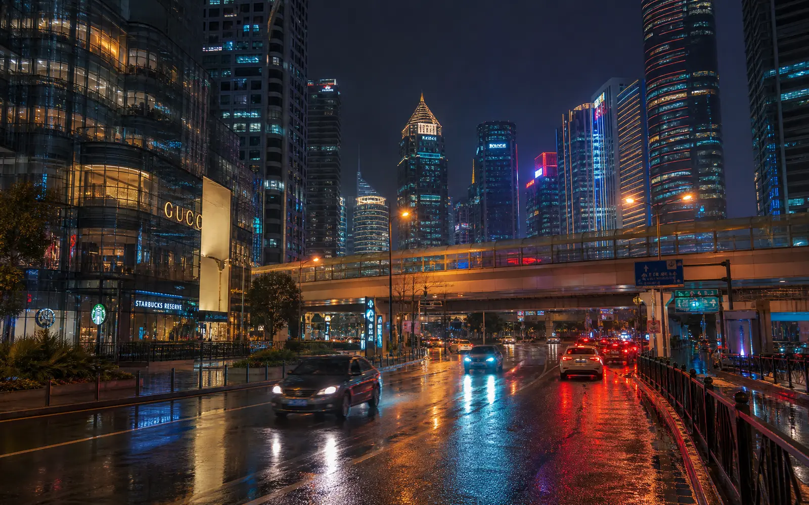

# glitch-core — WebGL GLSL Glitch Art Shaders

[](LICENSE)
[](https://github.com/samplemaple/glitch-core)

[中文](README.zh-CN.md)

> 19 production-grade GLSL fragment shaders for real-time glitch art and
> image effects — pixel sorting, RGB channel shift, scanlines, VHS, CRT,
> data corruption, and more. WebGL, GLES, Metal ready.



*Neon city glitch — RGB shift + scanlines + VHS + data glitch. Made with **[GlitchForge](https://glitchforge.org)**.*

## What is this?

A collection of 19 production-grade GLSL fragment shaders for real-time
glitch art and image effects. Upload an image, stack effects, adjust
parameters — instant WebGL preview.

Used in production by **[GlitchForge](https://glitchforge.org)** —
a free online glitch art tool (no watermark, full resolution export).
This repo is the shader engine extracted for use on any platform:
browser, mobile, CLI, or server.

**No build step. No framework lock-in.** Each shader is a single `.glsl`
file with documented uniforms. Drop them into any WebGL, GLES, or Metal
pipeline.

## Effects

| # | Effect | Key | Description |
|---|--------|-----|-------------|
| 1 | Pixel Sort | `pixel-sort` | Sort pixels by brightness along a direction |
| 2 | RGB Shift | `rgb-shift` | Shift red/blue channels horizontally |
| 3 | Scanlines | `scanlines` | CRT-style horizontal line overlay |
| 4 | Kaleidoscope | `kaleidoscope` | Radial symmetry mirroring |
| 5 | Wave | `wave` | Sinusoidal displacement |
| 6 | Mirror | `mirror` | Horizontal or vertical reflection |
| 7 | Duotone | `duotone` | Two-color gradient mapping |
| 8 | Channel Invert | `channel-invert` | Invert individual RGB channels |
| 9 | Hue Shift | `hue-shift` | Rotate hue in HSL space |
| 10 | Grain | `grain` | Film-grain noise overlay — animated |
| 11 | Halftone | `halftone` | CMYK-style dot pattern |
| 12 | Pixelate | `pixelate` | Block-pixel downsampling |
| 13 | VHS | `vhs` | Tracking lines + color bleed — animated |
| 14 | CRT | `crt` | Curved screen + chromatic aberration + vignette — animated |
| 15 | 8-Bit | `8bit` | Quantize to limited color palette |
| 16 | Edge Detect | `edge-detect` | Sobel edge detection |
| 17 | Brightness/Contrast/Saturation | `brightness` | Image adjustments |
| 18 | Data Glitch | `data-glitch` | Block corruption simulation |
| 19 | Stretch | `stretch` | Horizontal tearing and displacement |

## Quick Start

```bash
git clone https://github.com/samplemaple/glitch-core.git
cd glitch-core/web/demos
# Open any .html file in a browser — no build step, no server needed
open 01-pixel-sort-rgb-shift-scanlines.html
```

Each demo is a standalone HTML file with embedded WebGL boilerplate.
Upload an image, toggle effects, adjust sliders — instant preview.

## Repo Structure

```
glitch-core/
├── shaders/          ← 19 GLSL fragment shaders + 1 vertex shader
│                      Platform-agnostic. Used by every target below.
├── SPEC.md           ← Canonical effect spec — uniforms, types, ranges
├── web/              ← Platform: Web
│   ├── README.md
│   └── demos/        ← 6 standalone HTML demos (open in browser)
├── android/          ← Platform: Android (GLES2/GLES3)
├── ios/              ← Platform: iOS (Metal/GLES)
└── cli/              ← Platform: CLI / headless (CPU fallback)
```

**One folder per platform.** Add a new folder when you add a new target.

## Platform Support

| Platform | Status | Backend |
|----------|:------:|---------|
| Web (demos) | ✅ ready | WebGL 1.0 |
| Web (GlitchForge) | ✅ [live](https://glitchforge.org) | WebGL + Next.js |
| Android | 📋 planned | GLES 2.0 / GLES 3.0 |
| iOS | 📋 planned | Metal / GLES |
| CLI / Server | 📋 planned | Headless GL / CPU fallback |

## Architecture

```
                    ┌──────────────────────┐
                    │    shaders/*.glsl     │
                    │   (single source)     │
                    └──────┬───────────────┘
                           │
          ┌────────────────┼────────────────┐
          │                │                │
     ┌────▼────┐     ┌────▼────┐     ┌─────▼─────┐
     │   Web   │     │ Android │     │    iOS    │
     │ WebGL   │     │  GLES   │     │  Metal    │
     └─────────┘     └─────────┘     └───────────┘
```

All platforms share the same GLSL shaders.
Platform wrappers handle texture I/O, context management,
and uniform binding — the visual logic lives here.

## License

MIT — use it in open-source projects, commercial products,
mobile apps, CLI tools. No attribution required (but appreciated).

---

**Built with ❤️ by [GlitchForge](https://glitchforge.org)**
— Free online glitch art, no watermarks, full resolution.
